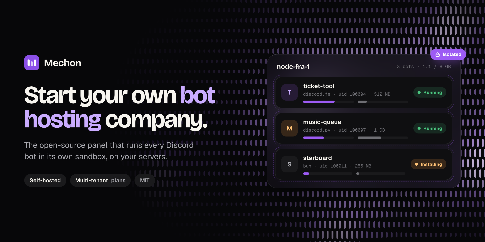
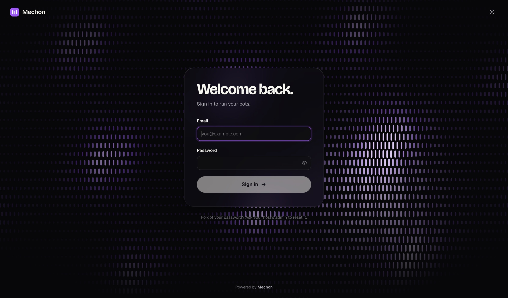

<div align="center">
<table width="100%">
  <tr>
    <td align="left" width="120">
      
    </td>
    <td>
      <h1>Mechon</h1>
      <h3>Start your own bot hosting company. The open-source, self-hosted panel that runs every Discord bot in its own sandbox.</h3>
    </td>
  </tr>
</table>



<p align="center">
  
  <a href="LICENSE"></a>
  
  
  <a href="https://github.com/jub0t/mechon/stargazers"></a>
</p>

</div>

> [!WARNING]
> Mechon is being rebuilt from scratch, in the open. It is **not ready to host customers yet**. See [where it stands](#status) and star or watch the repo to follow along.

## About

Mechon is a control panel for running a bot hosting business on your own servers. Install it, define the plans you sell, and give bot developers a clean place to deploy their bots, watch the logs and hit restart. Think Pterodactyl, but built for bots instead of game servers.

The part that matters is isolation. Every bot runs in its own locked-down container, as its own Linux user, with memory, CPU, process and disk limits the kernel enforces. A customer's bot cannot read another customer's token, touch their files, or starve their neighbours.

**Good for:** starting a Discord bot hosting company, adding bot hosting to an existing host, communities that host their members' bots, agencies running bots for clients. Next up: always-on AI agents and Telegram and Slack bots.

## Highlights

- 🔒 **Every bot in its own sandbox.** Its own container and Linux user, a read-only filesystem, no capabilities, no route to other bots or your private network.
- 📏 **Limits the kernel enforces.** Memory, CPU and process caps through cgroups, and a fixed-size disk per bot. Nothing gets polled and killed late.
- 🧾 **Plans and quotas.** Sell pools of bots, memory, CPU and disk. Every request is checked against the plan on the server.
- 💳 **Plugs into your billing.** An operator API and signed webhooks for Paymenter, WHMCS or Stripe. Mechon does not do billing and does not take a cut.
- 🚀 **Deploy any way.** Templates for discord.js, discord.py and Bun. Upload a folder, deploy from git, or ship from CI with an API key.
- 📟 **Live console and metrics.** Logs stream as they happen. CPU and memory per bot, and capacity per server.
- 🧱 **No open ports on your nodes.** The node agent dials out to the panel, so servers can sit behind NAT or a firewall.
- 🛡️ **A hardened tier.** Switch a plan to gVisor for an extra kernel boundary between customers.
- 📦 **Two binaries, no sprawl.** The panel (web UI built in) plus Postgres, and one agent per server next to Docker. No Kubernetes, no Redis.
- 🎨 **A panel people enjoy using.** Dark and light themes, <kbd>⌘</kbd> <kbd>K</kbd> everywhere.

## The panel



## Why not something else?

|  | **Mechon** | Pterodactyl | Coolify |
|---|---|---|---|
| Built for | Bots and agents | Game servers | Web apps |
| Sell hosting to customers with plans | ✅ | ✅ | ❌ |
| Per-customer quotas enforced by the server | ✅ | ✅ | ❌ |
| Bot templates out of the box | ✅ | Community eggs | Dockerfiles |
| Nodes need no inbound ports | ✅ | ❌ | ❌ |
| License | MIT | MIT | Apache 2.0 |

## Status

Mechon is built in milestones. The full plan is in [the v0 spec](docs/spec-v0.md), and every decision behind it is in [the decision log](docs/decisions.md).

- ✅ **Panel and sign-in.** Single binary with the web UI embedded, Postgres, admin and user roles.
- 🚧 **Plans, users and API keys.**
- 🚧 **Nodes.** The agent connects, reports capacity and gets its orders.
- 🚧 **Running bots.** Sandboxed containers, start, stop and restart, live logs and metrics.
- 🚧 **Deploys.** Upload, git and API, with rollback.
- 🚧 **Webhooks, the gVisor tier and the audit log.**

✅ Done · 🚧 In progress

## How it works

```
  customers ──HTTPS──▶  mechon (panel)  ◀──WebSocket, dialed by the agent──  mechon-agent ──▶ Docker
  your billing ──API──▶ • web UI + API                                       (one per server)  └ one sandbox per bot
                        • Postgres
```

The panel holds the desired state of every bot. Each server runs an agent that connects out to the panel, receives the full description of the bots it should run, and makes reality match. Drop the connection or reboot the server and it heals itself on reconnect.

## Try it

Mechon is not packaged yet. To run the development build you need Go 1.25+, Node 22+ with pnpm, and Postgres 15+.

```bash
git clone https://github.com/jub0t/mechon && cd mechon
createdb mechon_dev
make web          # build the web UI so the binary can embed it
make seed         # create a local admin: admin@mechon.test / dev-password-123
make dev-panel    # API on :8080
make dev-web      # UI with hot reload on :5173
```

Open http://localhost:5173 and sign in. Those credentials are for local development only. On a real install, create the first admin with `mechon init --email you@example.com`.

<details>
<summary><b>Configuration and tests</b></summary>

| Variable | Meaning |
|---|---|
| `MECHON_DATABASE_URL` | Postgres connection string (required) |
| `MECHON_PUBLIC_URL` | URL browsers use to reach the panel (required; sets the allowed origin and secure cookies) |
| `MECHON_LISTEN` | Listen address, default `:8080` |
| `MECHON_TRUST_PROXY` | `true` to take the client IP from `X-Forwarded-For` behind a reverse proxy |

Tests: `createdb mechon_test && make test`. The Go integration tests run against a real Postgres and wipe that database on every run.

</details>

## Contributing

> [!IMPORTANT]
> The most useful thing right now is to tell us what you need. Run a bot host, or want to? [Open an issue](https://github.com/jub0t/mechon/issues) with what your panel does badly today and what would make you switch.
>
> Want to write code? Read [the spec](docs/spec-v0.md) first: it says what is being built, in what order, and why.

## Star History

<a href="https://www.star-history.com/#jub0t/mechon&Date">
 <picture>
   <source media="(prefers-color-scheme: dark)" srcset="https://api.star-history.com/svg?repos=jub0t/mechon&type=Date&theme=dark" />
   <source media="(prefers-color-scheme: light)" srcset="https://api.star-history.com/svg?repos=jub0t/mechon&type=Date" />
   
 </picture>
</a>

## License

[MIT](LICENSE). Host it, modify it, sell hosting with it.
