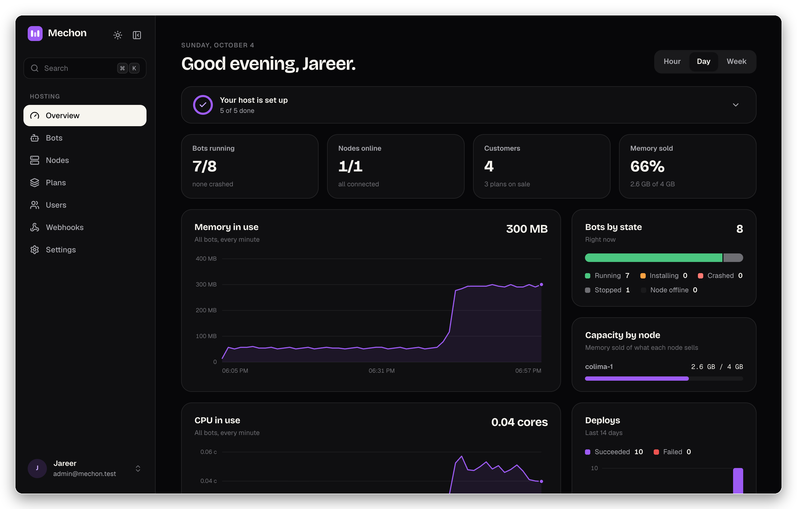
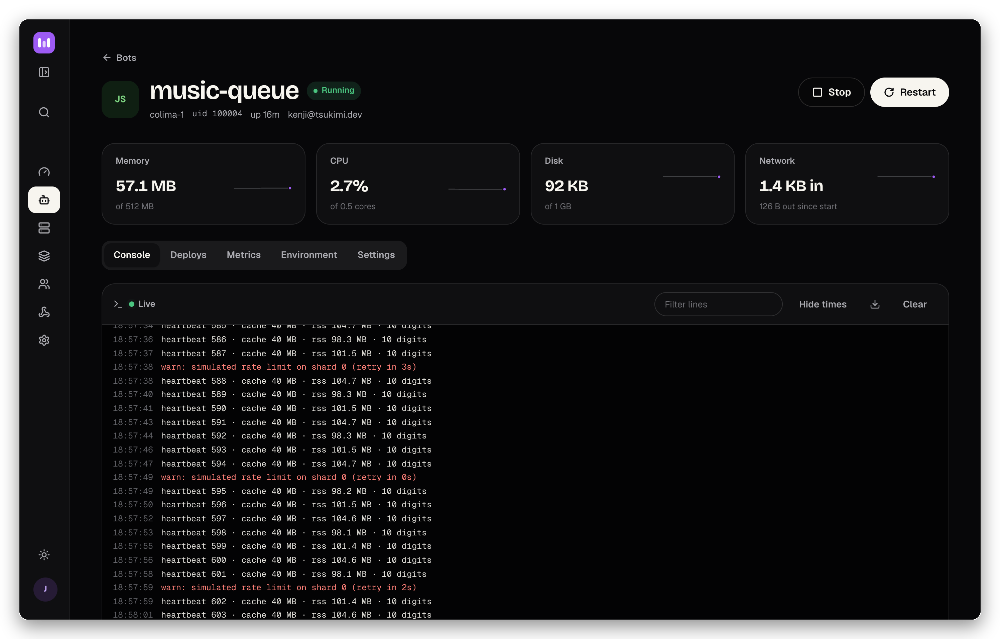
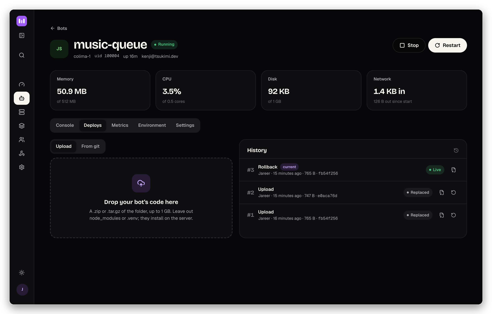
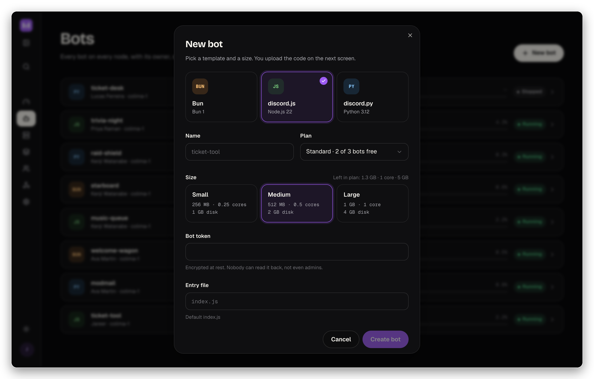
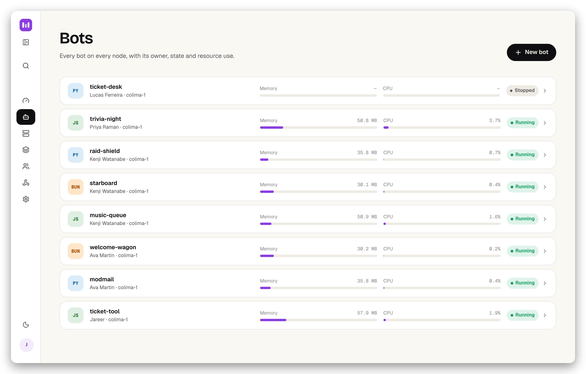

<div align="center">
<table width="100%">
  <tr>
    <td align="left" width="120">
      
    </td>
    <td>
      <h1>Mechon</h1>
      <h3>Start your own bot hosting company. A self-hosted panel that runs every Discord bot in its own sandbox.</h3>
    </td>
  </tr>
</table>



<p align="center">
  
  <a href="LICENSE"></a>
  
  
  <a href="https://github.com/jub0t/mechon/stargazers"></a>
</p>

</div>

## About

Mechon is Pterodactyl for bots. Install it on your servers, define the plans you sell, and your customers get a clean panel to deploy their bots, watch the logs and hit restart. You keep the servers, the customers and the money.

Every bot runs in its own locked-down container as its own Linux user, with memory, CPU, process and disk limits the kernel enforces. One customer's bot cannot read another's token, touch their files or starve their neighbours.

## Highlights

- 🔒 **A sandbox per bot.** Read-only filesystem, no capabilities, no route to other bots or your private network.
- 🧾 **Plans and quotas.** Sell pools of bots, memory, CPU and disk, with per-customer overrides when you need them.
- 🚀 **Deploy any way.** discord.js, discord.py and Bun templates. Upload a folder, deploy from git, or ship from CI.
- 📟 **Live console and metrics.** Logs as they happen, usage per bot, capacity per server.
- 💳 **Plugs into your billing.** An API and signed webhooks for Paymenter, WHMCS or Stripe. No cut, no lock-in.
- 📦 **Two binaries.** The panel with Postgres, and one agent per server next to Docker. Nodes dial out, so no ports to open.

## Screenshots

<table>
  <tr>
    <td width="50%"><p align="center"><sub>Live console and usage for every bot</sub></p></td>
    <td width="50%"><p align="center"><sub>Deploys by upload, git or API, with rollback</sub></p></td>
  </tr>
  <tr>
    <td width="50%"><p align="center"><sub>Pick a template and a size, paste the token</sub></p></td>
    <td width="50%"><p align="center"><sub>Every bot at a glance, dark or light</sub></p></td>
  </tr>
</table>

## The math

One [Hetzner AX41](https://www.hetzner.com/dedicated-rootserver/?drives=nvme) costs **about $65 a month**: 6 cores, 64 GB of RAM, 2× 512 GB NVMe. Keep 4 GB for the system and you have about 60 GB to sell. Bots mostly wait on the network, so memory runs out first.

| Plan (example price) | Per bot | Bots per server | Revenue / month | Profit / month |
|---|---|---|---|---|
| Starter · $1.50 | 256 MB, ¼ core, 1 GB disk | 240 | $360 | **$295** |
| Standard · $2.50 | 512 MB, ½ core, 2 GB disk | 120 | $300 | **$235** |
| Pro · $4.50 | 1 GB, 1 core, 5 GB disk | 60 | $270 | **$205** |

A server pays for itself at about 26 Standard customers. Taxes, payment fees and support are yours to add.

## Get started

Running it on a server: follow the [install guide](docs/install.md). Trying it locally needs Go, Node with pnpm, and Postgres:

```bash
git clone https://github.com/jub0t/mechon && cd mechon
createdb mechon_dev && make web && make seed   # admin@mechon.test / dev-password-123
make run                                       # then open http://localhost:8080
```

> [!WARNING]
> Mechon is in **preview**. Every [milestone](docs/spec-v0.md#11-build-order) is built and tested end to end, including a suite of isolation attacks that must all fail, but it has not run in production yet. Next up: a CLI, AI agent templates and the first release.

## Contributing

Run a bot host, or want to? [Open an issue](https://github.com/jub0t/mechon/issues) with what your panel does badly today. Want to write code? The [spec](docs/spec-v0.md) and the [decision log](docs/decisions.md) explain what is being built and why.

## Star History

<a href="https://www.star-history.com/#jub0t/mechon&Date">
 <picture>
   <source media="(prefers-color-scheme: dark)" srcset="https://api.star-history.com/svg?repos=jub0t/mechon&type=Date&theme=dark" />
   <source media="(prefers-color-scheme: light)" srcset="https://api.star-history.com/svg?repos=jub0t/mechon&type=Date" />
   
 </picture>
</a>

## License

[MIT](LICENSE). Host it, change it, sell hosting with it.
